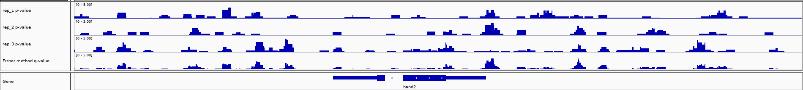

# macs2_replicates
Calling peaks with macs2 and combining infromation from replicates using Fisher method

Macs2 is the most popular tool for peak calling. ~While it offers support for combining
information from two replicates, it doesnt allow to combine more than two replicates.~
**actually Macs2 does support combining more than two replicates, pipeline in this repository will be updated to reflect this as Macs2 implementation is way faster**
Script in this repository allows this by first producing per bp p-values track in 
bedGraph format using Macs2 scripts and than combining them togheter by means of [Fisher method](https://en.wikipedia.org/wiki/Fisher%27s_method)
using script writen in R. This togheter creates easly understandable pipline for calling
peaks using multiple replicates.

# Dependecies
+ python3.6
+ python2.7
+ macs2
+ snakemake
+ deepTools [optional for ATAC-seq pipeline]

# Usage
Each pipeline is created using snakemake. To customize it for ones analysis one should
open appropiate `.snakefile` with text editor. At the top of each snakefile are the 
parameters that can be customize. Especially one should edit #input section to reflect
input files that are going to be processed. Samples should be named like `SAMPLE_REPLICATE.bam`

once the snakefile is edited to your likening the pipeline can be run by issuing following 
command:

`snakemake -s macs2_replicates_atacseq.snakefile sample.narrowPeak`

!!!Note: combine_pvalues.R must be in the same directory as snakefile

Check example_chip_seq for more detailed explanation

# All comments and suggestions are more than welcome!

This work was inspierd by [Genrich](https://github.com/jsh58/Genrich) and [Macs2](https://github.com/taoliu/MACS)
